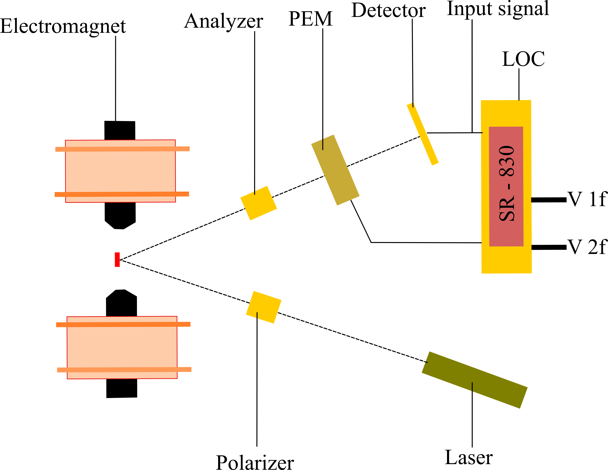

# MOKE-set-up
Magneto optic Kerr effect (MOKE) is an important characterization method for magnetic thin films. This code works for a set up comprising of a lock in amplifier to obtain a better MOKE signal during the measurements. The schematic of the MOKE set up is shown below in the figure.
 
